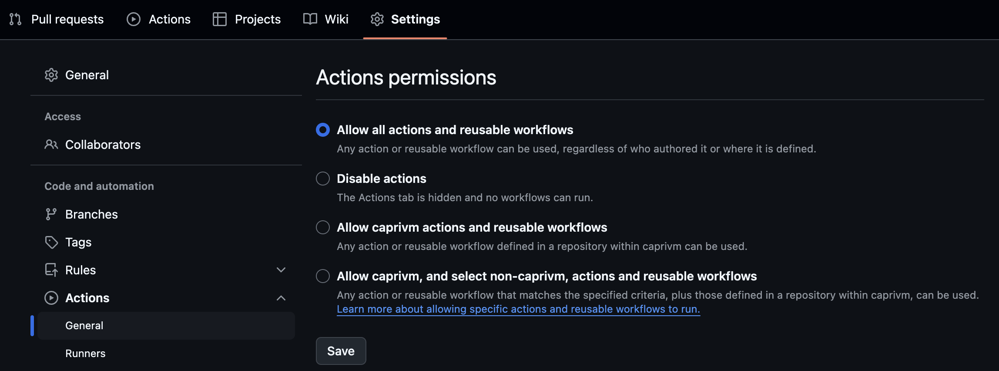

# Prerequisites

Before diving into GitHub Actions, ensure you have the prerequisites described in this document.

| **Version Control** | -                          |
| ------------------- | -------------------------- |
| `caprivm`           | <juan.caviedes@neoris.com> |
| Updated             | _May 5, 2025_              |

## Table of Contents

- [Prerequisites](#prerequisites)
  - [Table of Contents](#table-of-contents)
  - [Fork the Repository](#fork-the-repository)
  - [Enable GitHub Actions](#enable-github-actions)
  - [Structure of a Workflow](#structure-of-a-workflow)
    - [About Triggers](#about-triggers)
    - [About Steps](#about-steps)

## Fork the Repository

Please fork the repository to your GitHub account repositories.

> Copy the `main` branch only.

## Enable GitHub Actions

Actions must first be allowed to run on your forked repository.

## Structure of a Workflow

All workflows must have a basic structure for their execution. The necessary initial blocks are: `name`, `on`, and `jobs`.

- The `name` field groups workflow executions under a single option in the repository's Actions sidebar.
- `on` is the type of workflow trigger.
- Jobs must include `runs-on` and `steps`, or alternatively, reference a reusable workflow.

> - [Workflow Syntax for GitHub Actions](https://docs.github.com/en/actions/writing-workflows/workflow-syntax-for-github-actions)
> - [Available GitHub-hosted Runners](https://docs.github.com/en/actions/writing-workflows/workflow-syntax-for-github-actions#standard-github-hosted-runners-for--private-repositories)

### About Triggers

When triggering a workflow by an event, there are some special considerations:

- If the trigger is `schedule`, _scheduled workflows run on the latest commit on the default or base branch_.
- If the trigger is `workflow_dispatch`, and it's the first time you add the workflow to the repository is in a commit that does not belong to the default branch (normally `main` or `master`), you will not be able to manually trigger the workflow. To resolve this, you can either change the default branch or add the workflow to the default branch.

### About Steps

You can build Docker container, JavaScript, and composite actions. Each action requires a metadata file that defines its inputs, outputs, and main entry point.

> Learn more about custom actions in the [GitHub Documentation](https://docs.github.com/en/actions/sharing-automations/creating-actions/about-custom-actions).

## References

| Number | Name                  | Link                                                                                                                                                                                |
| ------ | --------------------- | ----------------------------------------------------------------------------------------------------------------------------------------------------------------------------------- |
| 1      | Workflow Syntax         | [Workflow Syntax for GitHub Actions](https://docs.github.com/en/actions/writing-workflows/workflow-syntax-for-github-actions)                                                       |
| 2      | GitHub-hosted Runners   | [Available GitHub-hosted Runners](https://docs.github.com/en/actions/writing-workflows/workflow-syntax-for-github-actions#standard-github-hosted-runners-for--private-repositories) |
| 3      | Official Documentation  | [GitHub Documentation](https://docs.github.com/en/actions/sharing-automations/creating-actions/about-custom-actions)                                                                |
